Meet Joe. Joe is a software engineer who got tired of debugging production incidents at 3am and decided to pursue their true passion: making really good coffee. So they opened **Café Joe** - a small artisan coffee shop in a quiet neighbourhood.

But here's the thing about Joe - you can take the engineer out of tech, but you can't take the tech out of the engineer. Joe wanted a real-time dashboard showing orders as they came in. Revenue per hour. Top selling drinks. The works.

This is the story of how Joe's simple dashboard evolved as the business grew - and the architectural lessons learned along the way.

---

## Chapter 1: The Humble Beginning (V1)

When Café Joe first opened, traffic was modest. Maybe 50-100 orders per day. Joe needed something simple - something they could build in a weekend between roasting beans and perfecting latte art.

### The V1 Architecture

The solution was beautifully simple:

1. **Orders API** - A FastAPI service that accepts orders and writes them directly to PostgreSQL
2. **Cron Job** - A scheduled task running every 60 seconds that aggregates metrics
3. **Redis Cache** - Stores the pre-computed metrics for the dashboard
4. **Dashboard** - Polls Redis and displays pretty charts

```mermaid
flowchart LR
    subgraph "Customer Orders"
        A[☕ Order]
    end

    subgraph "V1 Architecture"
        B[API<br/>FastAPI]
        C[(PostgreSQL)]
        D[Aggregator<br/>⏰ Cron Job]
        E[(Redis<br/>Cache)]
        F[📊 Dashboard]
    end

    A -->|POST /order| B
    B -->|INSERT| C
    D -->|SELECT every 60s| C
    D -->|SET metrics| E
    F -->|GET metrics| E
```



### The Code

The API handler was dead simple - accept an order, write to the database, return success:

```python
async def create_order_v1(order: OrderCreate, db: Session):
    db_order = Order(**order.dict())
    db.add(db_order)
    db.commit()  # Blocks until write completes
    return {"status": "ok", "order_id": db_order.id}
```

The aggregator cron job ran every minute:

```python
def aggregate_metrics():
    # Query last hour of orders
    orders = db.query(Order).filter(
        Order.timestamp > datetime.now() - timedelta(hours=1)
    ).all()

    # Compute metrics
    metrics = {
        "hourly_count": len(orders),
        "hourly_revenue": sum(o.price for o in orders),
        "top_drinks": get_top_drinks(orders)
    }

    # Cache in Redis
    redis.set("metrics:hourly", json.dumps(metrics))
```

### The Good

- **Simple to understand** - Anyone could debug it
- **Easy to deploy** - Just an API and a cron job
- **Low resource usage** - Ran on a tiny VM

### The Bad

- **60-second latency** - Metrics were always stale
- **API latency tied to database** - Slow DB = slow orders
- **Silent failures** - If cron died, dashboard just... stopped updating

Joe was happy. The dashboard worked. Life was good.

---

## Chapter 2: The Growth Spurt (V2)

Then something unexpected happened. A food blogger with 500k followers posted about Café Joe's flat white. Suddenly, orders went from 100/day to 100/hour. The V1 architecture started showing cracks:

- API response times spiked during lunch rush (database writes blocking)
- 60-second old data felt painfully stale during peak hours
- The cron job occasionally timed out trying to aggregate too many orders

Joe needed something better. Enter **Redis Streams**.

### The V2 Architecture

The key insight: **decouple the API from the database write**. Instead of writing directly to PostgreSQL, the API pushes orders to a Redis Stream. A background worker consumes the stream and handles persistence.

```mermaid
flowchart LR
    subgraph "Customer Orders"
        A[☕ Order]
    end

    subgraph "V2 Architecture"
        B[API<br/>FastAPI]
        C[(Redis<br/>Streams)]
        D[Stream<br/>Worker]
        E[(PostgreSQL)]
        F[(Redis<br/>Metrics)]
        G[📊 Dashboard]
    end

    A -->|POST /order| B
    B -->|XADD| C
    C -->|XREADGROUP| D
    D -->|Batch INSERT| E
    D -->|Real-time UPDATE| F
    G -->|GET metrics| F

    style B fill:#90EE90
    style C fill:#FFB6C1
```



### The Magic of Redis Streams

Redis Streams gave Joe some superpowers:

1. **Durability** - Unlike Pub/Sub, messages persist even if no consumer is listening
2. **Consumer Groups** - Track which messages have been processed
3. **Acknowledgments** - Only remove messages after successful processing

The API became blazing fast:

```python
async def create_order_v2(order: OrderCreate, redis: Redis):
    message_id = str(uuid.uuid4())  # For deduplication

    await redis.xadd("orders", {
        "message_id": message_id,
        "drink": order.drink,
        "store": order.store,
        "price": str(order.price),
        "version": "v2"
    })

    return {"status": "queued", "message_id": message_id}
    # Returns in ~3ms instead of ~15ms!
```

The stream worker processed orders in batches:

```python
async def process_orders():
    while True:
        # Read up to 100 orders, or timeout after 2 seconds
        messages = await redis.xreadgroup(
            "workers", "worker-1", {"orders": ">"},
            count=100, block=2000
        )

        if messages:
            # Batch insert to PostgreSQL
            orders = [parse_order(m) for m in messages]
            await batch_insert(orders)

            # Update metrics in real-time
            await update_metrics(orders)

            # Acknowledge processed messages
            await redis.xack("orders", "workers", *[m.id for m in messages])
```

### Handling Duplicates

Joe added a `message_id` column to handle potential duplicates (at-least-once delivery):

```sql
INSERT INTO orders (message_id, drink, store, price, timestamp)
VALUES ($1, $2, $3, $4, $5)
ON CONFLICT (message_id) DO NOTHING;
```

### The Results

| Metric            | V1         | V2       |
| ----------------- | ---------- | -------- |
| API Response Time | ~15ms      | ~3ms     |
| Metrics Latency   | 60 seconds | ~200ms   |
| Max Throughput    | ~100/sec   | ~500/sec |

Joe was thrilled. The dashboard updated in near real-time. API responses were snappy. Peak lunch rush was no longer scary.

---

## Chapter 3: The Franchise Dream (V3)

Two years passed. Café Joe was now a local legend. Joe opened three more locations: **Downtown**, **Airport**, and **Uptown**. Orders hit 1000+ per second during morning rush.

The V2 architecture hit its ceiling:

- Single Python stream worker became CPU-bound
- Redis Streams, while durable, lived entirely in memory
- No way to scale horizontally - just one worker processing everything
- Complex aggregations (per-store metrics, rolling windows) were getting hacky

Joe needed industrial-grade streaming. Time to bring out the big guns: **Apache Kafka** and **Apache Flink**.

### The V3 Architecture


### Why Kafka?

Kafka gave Joe what Redis Streams couldn't:

1. **Disk-based durability** - Messages persist to disk, survive restarts
2. **Partitioning** - Orders partitioned by store for parallel processing
3. **Replication** - Data replicated across brokers for fault tolerance
4. **Replay** - Can reprocess historical data from any point

```python
async def create_order_v3(order: OrderCreate, producer: AIOKafkaProducer):
    message_id = str(uuid.uuid4())

    await producer.send_and_wait(
        "orders",
        key=order.store.encode(),  # Partition by store
        value=json.dumps({
            "message_id": message_id,
            "drink": order.drink,
            "store": order.store,
            "price": float(order.price),
            "version": "v3"
        }).encode()
    )

    return {"status": "queued", "message_id": message_id}
```

### Why Flink?

Flink is a distributed stream processing engine that handles:

1. **Parallel Processing** - Multiple TaskManagers process different partitions
2. **Windowing** - Aggregate data in time windows (tumbling, sliding, session)
3. **Exactly-Once Semantics** - Checkpointing ensures no data loss or duplicates
4. **Stateful Processing** - Maintain state across events (running totals, etc.)

The Flink job (simplified):

```java
DataStream<CoffeeOrder> orders = env
    .addSource(new FlinkKafkaConsumer<>("orders", ...))
    .filter(order -> order.getVersion().equals("v3"));

// Sink 1: Write to PostgreSQL with deduplication
orders.addSink(new PostgresSink());

// Sink 2: Aggregate metrics per store in 1-second windows
orders
    .keyBy(CoffeeOrder::getStore)
    .window(TumblingProcessingTimeWindows.of(Time.seconds(1)))
    .aggregate(new MetricsAggregator())
    .addSink(new RedisMetricsSink());
```

### Checkpointing: The Secret Sauce

Flink's killer feature is **checkpointing**. Every 10 seconds, Flink snapshots:

- Current Kafka offsets
- In-flight window state
- Any accumulated aggregations

If a TaskManager crashes, Flink restores from the last checkpoint and replays from Kafka. Zero data loss. Exactly-once processing.

```
┌─────────────────────────────────────────────────────────┐
│                    Checkpoint T=10s                     │
│  ┌─────────────┐  ┌─────────────┐  ┌─────────────┐      │
│  │ Kafka       │  │ Window      │  │ Pending     │      │
│  │ Offsets     │  │ State       │  │ Writes      │      │
│  │ P0: 1523    │  │ uptown: 42  │  │ [order_123, │      │
│  │ P1: 892     │  │ downtown:38 │  │  order_124] │      │
│  │ P2: 1101    │  │ airport: 15 │  │             │      │
│  └─────────────┘  └─────────────┘  └─────────────┘      │
└─────────────────────────────────────────────────────────┘
```

### The Results

| Metric             | V1           | V2            | V3               |
| ------------------ | ------------ | ------------- | ---------------- |
| API Response Time  | ~15ms        | ~3ms          | ~5ms             |
| Metrics Latency    | 60 sec       | ~200ms        | ~100ms           |
| Max Throughput     | ~100/sec     | ~500/sec      | **1000+/sec**    |
| Delivery Guarantee | At-most-once | At-least-once | **Exactly-once** |
| Horizontal Scaling | ❌           | ❌            | ✅               |

---

## The Crossover Points

When should you upgrade? Here's what Joe learned:

```
┌────────────────────────────────────────────────────────────┐
│                                                            │
│  Orders/sec    Architecture Choice                         │
│                                                            │
│     0-100   →  V1 (Cron) - Keep it simple                  │
│   100-500   →  V2 (Redis Streams) - Need real-time         │
│   500+      →  V3 (Kafka+Flink) - Need scale               │
│                                                            │
│  ────────┬──────────┬───────────────────────────────────►  │
│          │          │                                      │
│         V1→V2     V2→V3                                    │
│         ~100/s    ~500/s                                   │
│                                                            │
└────────────────────────────────────────────────────────────┘
```

**Don't over-engineer early.** V3 has significant operational complexity:

- Kafka cluster management
- Flink JobManager/TaskManager orchestration
- Java/Scala expertise for streaming jobs
- Higher memory footprint (~3GB vs ~200MB)

Start with V1. Graduate to V2 when you feel the pain. Only move to V3 when you're hitting V2's ceiling.

---

## Key Takeaways

1. **Start simple.** A cron job is a perfectly valid real-time solution when "real-time" means "within a minute."

2. **Decouple when needed.** Moving writes to a queue (V2) gives you breathing room without massive complexity.

3. **Distributed streaming is powerful but expensive.** Kafka + Flink is overkill until you genuinely need exactly-once semantics and horizontal scaling.

4. **The right architecture depends on your scale.** There's no shame in running V1 forever if it meets your needs.

5. **Keep your dashboard dumb.** All three versions write to the same Redis keys. The frontend never knew the difference.

---

## The Repository

The full source code is available at [github.com/jfgrea27/coffee-rt](https://github.com/jfgrea27/coffee-rt). This isn't just a toy example - it's a production-ready project with:

| Feature | Status |
|---------|--------|
| **CI/CD** | GitHub Actions for build, test, and deploy |
| **Test Coverage** | >85% across all components |
| **Dashboard UI** | Real-time React dashboard with live metrics |
| **Monitoring** | Grafana dashboards with Prometheus and Loki |
| **Infrastructure** | Full Terraform/Terragrunt setup for Azure |
| **Benchmarking** | Infrastructure ready, needs cloud credits for results |

The repository includes:

- **Backend services** - FastAPI order API, stream workers, Flink jobs
- **Frontend** - React dashboard polling Redis for live updates
- **Docker Compose** - One-command local setup for each architecture version
- **Helm charts** - Production-ready Kubernetes deployments
- **Monitoring stack** - Grafana dashboards with Prometheus metrics and Loki logs
- **Terraform modules** - Modular Azure infrastructure (AKS, ACR, networking)
- **Load testing** - Breakpoint testing infrastructure with results upload

---

## Want to See Real Benchmarks?

The repository includes everything you need to run your own tests:

### A Note on Benchmarking

I started running scaling tests on my local machine, but quickly realised my laptop was becoming an unfair bottleneck - the CPU and memory constraints meant I was benchmarking my MacBook rather than the architectures themselves.

To get proper, reproducible numbers, I've built out the full infrastructure to run these benchmarks on Azure (you can see the Terraform modules and Helm charts in the [repository](https://github.com/jfgrea27/coffee-rt)).

### The Azure Infrastructure

The benchmarking infrastructure is built on **Azure Kubernetes Service (AKS)** using Terraform and Terragrunt for infrastructure-as-code. Here's what the setup looks like:


**Key components:**

| Component             | Purpose                                        |
| --------------------- | ---------------------------------------------- |
| **AKS (Private)**     | Kubernetes cluster with no public API exposure |
| **Bastion VM**        | Jump box with kubectl, helm, k9s pre-installed |
| **ACR**               | Private container registry for all images      |
| **Workload Identity** | Pods authenticate to Azure without secrets     |
| **GitHub OIDC**       | CI/CD without long-lived credentials           |
| **Blob Storage**      | Stores load test results for analysis          |

**The load testing workflow:**

1. GitHub Actions builds and pushes images to ACR via OIDC
2. Helm deploys the load-tester to AKS
3. Load-tester runs breakpoint tests (ramping from 20 → 1000 concurrent users)
4. Results are uploaded to Blob Storage via workload identity
5. `terraform destroy` tears everything down to save costs

The infrastructure is modular - seven Terraform modules that can be deployed independently:

```
infra/
├── modules/
│   ├── resource-group/    # Azure resource container
│   ├── vnet/              # Network isolation
│   ├── aks/               # Kubernetes cluster
│   ├── acr/               # Container registry
│   ├── bastion/           # Secure admin access
│   ├── github-oidc/       # CI/CD authentication
│   └── storage/           # Load test results
└── environments/
    └── dev/               # Cost-optimized dev config
```

**The catch?** Cloud costs. Even with spot instances and burstable VMs, running AKS clusters adds up quickly. I have to `terraform destroy` everything when I'm not actively running tests to avoid burning through credits. If you'd like to see real p95/p99 latency numbers and proper crossover point analysis, consider buying me a coffee to help cover the Azure bill.

Until then, happy brewing! ☕

---

_This post is part of a series exploring real-time data architectures. The fictional "Café Joe" is inspired by real architectural patterns used in production systems._
